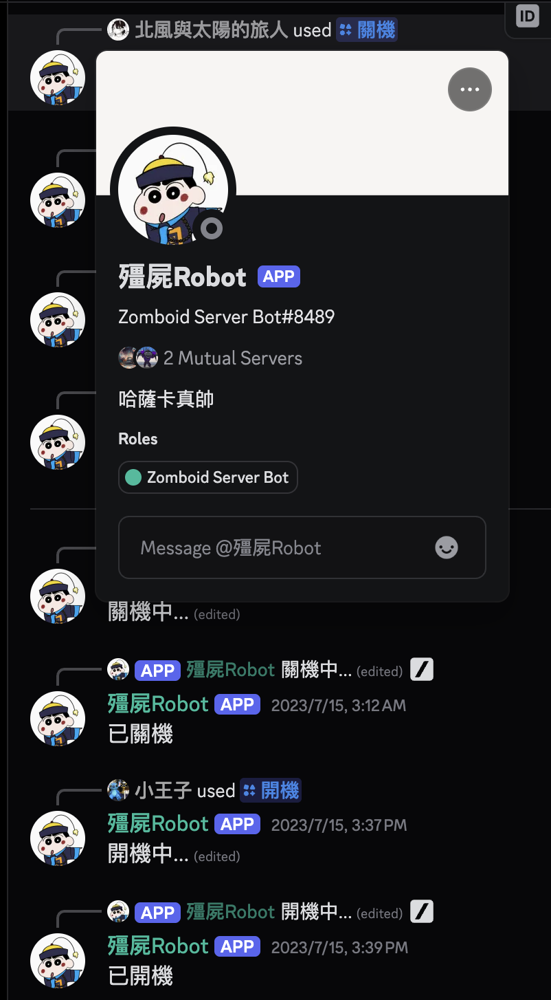

## Discord Bot

[](https://nodejs.org/)
[](https://discord.js.org/)
[](https://aws.amazon.com/)
[](https://opensource.org/licenses/MIT)

Node.js Discord bot using discord.js v14. Provides slash commands to manage an AWS EC2-hosted Project Zomboid server, Soulworker guide links, and a simple message responder.

<div align="center">
  
</div>

### Features
- **Slash commands**
  - **/開機**: Start EC2 instance (if stopped) and start Project Zomboid via SSH.
  - **/關機**: Save and stop Project Zomboid, then shutdown the EC2 instance.
  - **/攻略**: Return Soulworker guide links for characters/raids/others.
  - **/版本**: Show bot version.
- **Message responder**
  - Text "Hello" → reply "Hello <username>".
- **Permissions & cooldowns**
  - Role-gated for **/開機** and **/關機**: names containing `管理員`、`元老成員`、`優秀成員`.
  - Per-user cooldowns: default 3s; `/開機` & `/關機` 60s; `/攻略` 5s.

### Requirements
- Node.js ≥ 16.9.0 (discord.js v14). Recommended: Node.js 18+
- Yarn or npm
- AWS credentials available in runtime environment (profile/ENV/instance role). Region is set to `ap-northeast-1` in `Services/aws.js`.

### Getting Started
1. Install dependencies
   - Yarn: `yarn install`
   - npm: `npm install`
2. Configure environment variables
   - Copy `.env.sample` to `.env` and fill values:
     - `token`: Discord bot token
     - `clientId`: Discord application (bot) ID
     - `guildId`: Target guild ID for slash command registration
     - `host`: EC2 public DNS or IP
     - `user`: SSH username (e.g., `ec2-user`)
     - `pemfile`: Absolute path to your PEM key file
     - `userpassword`: Sudo password used for shutdown
3. Deploy slash commands (first time and whenever commands change)
   - Yarn: `yarn deploy-command`
   - npm: `node deploy-commands.js`
4. Run the bot
   - Development: `yarn start` (or `npm start`)
   - With PM2: `yarn server:start` / remove with `yarn server:remove`

### Usage
- Use `/開機` to boot the EC2 (when stopped) and start the game server (`pzserver start`).
- Use `/關機` to save & quit the game (`pzserver quit`) and shutdown the instance (`sudo halt`).
- Use `/攻略` to select an option and receive the corresponding guide link.
- Use `/版本` to display the current bot version.

Notes:
- Only members whose role names contain `管理員`、`元老成員`、`優秀成員` can run `/開機` and `/關機`.
- Cooldowns are enforced per-user; attempting during cooldown returns an ephemeral remaining time.

### Project Structure
```
commands/
  common/
    close.js       # /關機
    guides.js      # /攻略
    open.js        # /開機
    version.js     # /版本
constants/
  ec2.js           # EC2 status codes & instance IDs
  guild.js         # Allowed role name fragments
  soulworker.js    # Guides mapping
events/
  interactionCreate.js  # Slash interaction handling & cooldowns
  ready.js              # Ready event log
Services/
  aws.js          # aws-sdk config (region)
  ec2.js          # EC2 client
deploy-commands.js # Slash command registration to guild
index.js           # Bot entrypoint
```

### Security & Operational Notes
- Keep your PEM key secure and with restrictive permissions (e.g., `chmod 400`).
- Do not commit `.env` or credentials; `.env.sample` is provided for reference.
- Ensure the runtime environment has valid AWS credentials/role to control EC2.
- The AWS region is hardcoded to `ap-northeast-1` in `Services/aws.js`; change if needed.

### License
MIT


